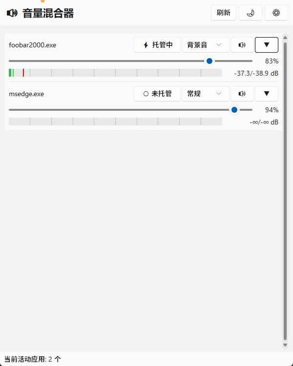
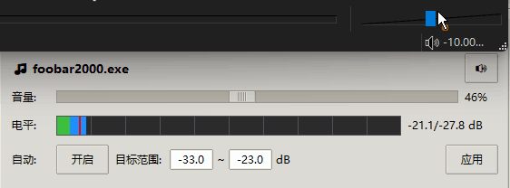

# 音量混合器 (Volume Mixer)

一个基于Windows Core Audio API的音量混合器应用，支持显示和调节各应用的音量，并提供实时音量监控和自动调节功能。

## 功能特性

- 🎵 **应用音量显示** - 显示所有正在播放音频的应用程序
- 🎚️ **音量调节** - 通过滑块调节每个应用的音量
- 📊 **实时音量表** - 显示原始电平和实际输出电平
- 🔊 **分贝显示** - 实时显示音量的dB值
- 🔇 **静音控制** - 每个应用可单独静音
- 🤖 **自动调节** - 自动调整音量以保持目标电平范围
- 🔉 **前景音/背景音** - 智能压低背景音，突出前景音
- 🚀 **无UI模式** - 支持后台静默运行
- 💾 **配置保存** - 自动保存和加载所有设置

## 界面预览



## 功能演示

图为旧版UI，功能一致


## 安装依赖

```bash
pip install -r requirements.txt
```

## 使用方法

### 有UI模式（默认）

```bash
python volume_mixer.py
```

### 无UI模式（后台服务）

```bash
python volume_mixer.py --no-gui
# 或
python volume_mixer.py -n
```

## 自动调节功能

1. 点击应用的"自动"按钮启用自动调节
2. 设置目标电平范围（如 -30 ~ -20 dB）
3. 点击"应用"保存设置
4. 程序会自动调整音量，使实际输出电平保持在目标范围内

## 前景音/背景音功能

智能压低背景音，突出前景音，适用于游戏时听音乐、视频通话等场景。

### 使用方法

1. **设置全局参数**：
   - **前景音阈值**：当前景音高于此dB值时触发压低（默认 -40 dB）
   - **背景音比例**：背景音相对前景音的音量百分比（默认 30%）

2. **标记应用角色**：
   - 将需要突出的应用（如音乐播放器）标记为"前景"
   - 将需要压低的应用（如游戏）标记为"背景"

3. **工作原理**：
   - 当前景音的实际输出电平 > 阈值时，背景音自动压低到前景音音量的指定比例
   - 当前景音 < 阈值时，背景音逐步恢复到原始音量

### 使用示例

场景：边玩游戏边听音乐
1. 播放音乐 → 标记为"前景"
2. 运行游戏 → 标记为"背景"
3. 设置阈值 -40dB，比例 30%
4. 当音乐响起时，游戏音量自动压低到音乐的30%
5. 音乐停止后，游戏音量自动恢复

## 配置文件

配置文件 `volume_mixer_config.json` 会自动保存在程序目录，包含各应用的自动调节设置。

## 技术栈

- Python 3.x
- tkinter (UI界面)
- pycaw (Windows音频API)
- psutil (进程信息)
- pystray (系统托盘)
- Pillow (图标生成)

## 许可证

MIT License