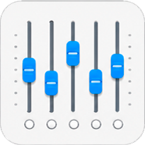

# 音量混合器 (Volume Mixer)

一个基于 Windows Core Audio API 的音量混合器应用，支持显示和调节各应用音量，并提供实时音量监控、自动调节、前景音/背景音控制，以及无 UI 后台运行模式。

## 功能特性

- 🎵 **应用音量显示** - 显示所有正在播放音频的应用程序
- 🎚️ **音量调节** - 通过滑块调节每个应用的音量
- 📊 **实时音量表** - 显示原始电平和实际输出电平

- 🤖 **自动调节** - 自动调整音量以保持目标电平范围
- 🔉 **前景音/背景音** - 智能压低背景音，突出前景音
  
- 🚀 **无 UI 模式** - 支持后台静默运行

## 界面预览


## 功能演示

图为旧版 UI，功能一致。


## 项目结构

- `volume_mixer.py`：程序入口，负责启动 GUI 或后台服务
- `audio_backend.py`：后台核心逻辑，包含版本号、音频会话管理、配置读写、自动调节与前景/背景音控制
- `volume_mixer_gui.py`：图形界面层，负责窗口、交互、图标与界面刷新
- `volume_mixer_service.py`：无 UI 后台服务入口
- `app_icon.png`：原始图标资源
- `app_icon.ico`：Windows 可执行文件和窗口图标资源
- `volume_mixer.spec`：PyInstaller 打包配置
- `build_release.ps1` / `build_release.bat`：一键打包脚本

## 安装依赖

### 运行依赖

```bash
pip install -r requirements.txt
```

### 打包依赖

```bash
pip install -r requirements-build.txt
```

## 使用方法

### 有 UI 模式（默认）

```bash
python volume_mixer.py
```

### 无 UI 模式（后台服务）

```bash
python volume_mixer.py --no-gui
# 或
python volume_mixer.py -n
```

## 自动调节功能

1. 点击应用的托管按钮启用自动调节
2. 设置目标电平范围，例如 `-30 ~ -20 dB`
3. 点击“应用”保存设置
4. 程序会自动调整音量，使实际输出电平保持在目标范围内

## 前景音/背景音功能

智能压低背景音，突出前景音，适用于游戏时听音乐、视频通话等场景。

### 使用方法

1. **设置全局参数**：
   - **前景音阈值**：当前景音高于此 dB 值时触发压低，默认 `-40 dB`
   - **背景音比例**：背景音相对前景音的音量百分比，默认 `30%`
2. **标记应用角色**：
   - 将需要突出的应用标记为“前景音”
   - 将需要压低的应用标记为“背景音”
3. **工作原理**：
   - 当前景音的实际输出电平高于阈值时，背景音自动压低到前景音音量的指定比例
   - 当前景音低于阈值时，背景音逐步恢复到原始音量

### 使用示例

场景：边玩游戏边听音乐

1. 播放音乐并标记为“前景音”
2. 运行游戏并标记为“背景音”
3. 设置阈值 `-40 dB`，比例 `30%`
4. 当音乐响起时，游戏音量自动压低到音乐的 `30%`
5. 音乐停止后，游戏音量自动恢复

## 配置文件

配置文件 `volume_mixer_config.json` 会自动保存在程序目录中，包含：

- 全局设置
- 各应用的自动调节参数
- 前景音/背景音角色设置
- 界面主题与帧率设置

## 打包发布

### 一键打包

#### PowerShell

```powershell
powershell -ExecutionPolicy Bypass -File .\build_release.ps1
```

#### 批处理

```bat
build_release.bat
```

### 打包输出

打包完成后，产物目录位于：

```text
dist\VolumeMixer
```

主程序为：

```text
dist\VolumeMixer\VolumeMixer.exe
```

## 技术栈

- Python 3.11+
- tkinter
- pycaw
- psutil
- comtypes
- pystray
- Pillow
- sv-ttk
- PyInstaller

## 许可证

MIT License
